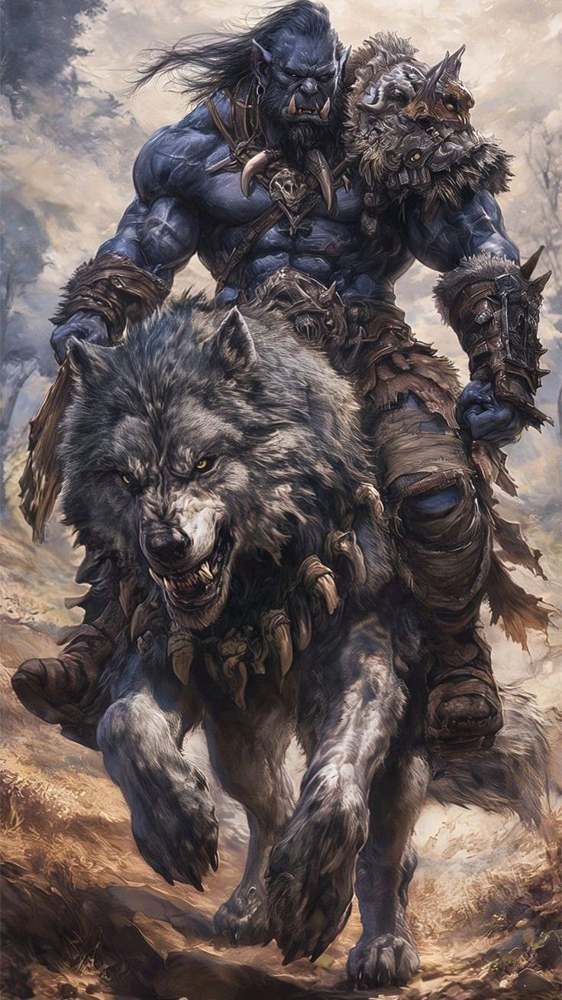

#ORCS RULES

##Resumen del origen y llegada de los orcos:

-Origen:
Los orcos originalmente vivían en Draenor, un mundo que compartían con los draenei. Eran una sociedad chamánica y tribal, no inherentemente malvada.

-Corrupción:
La Legión Ardiente (Burning Legion), liderada por Sargeras, manipuló a los orcos a través del demonio Kil'jaeden. Él utilizó al brujo orco Gul'dan para corromperlos con magia vil, haciéndolos más violentos y sedientos de sangre (por ejemplo, al beber la sangre de Mannoroth).

-El Portal Oscuro:
Usando la energía de Draenor y la ayuda de Gul'dan, el brujo Medivh (manipulado por Sargeras) abrió el Portal Oscuro entre Draenor y Azeroth.

-La Primera Guerra:
A través de ese portal, los orcos invadieron Azeroth, dando inicio a la Primera Guerra, enfrentándose al reino humano de Stormwind.

🏹

##Alchile que esos weyes no eran del todo malos

*Los orcos no eran naturalmente malvados; muchos fueron víctimas de manipulación demoníaca.

Después de varias guerras y la eventual destrucción parcial de Draenor (convirtiéndose en Terrallende / Outland), algunos orcos buscaron redención bajo el liderazgo de Thrall.

---

## Créditos y fuentes

- Imágenes obtenidas de [Blizzard Entertainment](https://www.blizzard.com)
- Información basada en la historia oficial de Warcraft y WoW.
- Markdown y GitHub por facilitar la documentación colaborativa.

---

*¡Gracias por leer! Si te gustó, no olvides dejar una estrella ⭐ en el repositorio.*
